Building a Book Recommendation System Using Collaborative Filtering
Algorithm
================
Rolando Asisten, Jr., HarvardX: PH125.9x
6/16/2019

data set used: goodbooks-10k data set

# 1\. EXECUTIVE SUMMARY

In the world of big data and endless choice permutations, finding the
products we want is like finding a needle in a haystack. We spend
countless of hours browsing the internet, and oftentimes, we suffer from
choice paralysis. Have you ever wondered how Amazon, or any other online
companies, paired us with their product recommendations?

They use a combination of machine learning algorithms such as
User-based/Item-based Nearest Neighbor Collaborative Filtering (“wisdom
of the crowd”) and certain techniques like Principal Component Analysis,
Single Value Decomposition and Matrix Factorization to solve product
recomendation problems.

This project aims at building a model that can be used to recommend
books. The data used to come up with a model is the “goodbooks-10k” data
set by Goodreads. According to it Wikipedia page, *“Goodreads is a
social cataloging website that allows individuals to freely search its
database of books, annotations, and reviews. Users can sign up and
register books to generate library catalogs and reading lists. They can
also create their own groups of book suggestions, surveys, polls, blogs,
and discussions. The company is owned by the online retailer Amazon”.*

The data set is composed of 6 million book reviews and several predictor
variables such as author, tags, year of publication, text counts and
title length. It is composed of four files : ratings, books, book\_tags,
and tags.

To achieve the study’s goal, a model based on Collaborative Filtering
was developed by training a model for the data that can predict with
minimum possible error the ratings in a testing data set. The underlying
assumption of this model is that if person A has the same opinion as
person B on an issue, A is more likely to have B’s opinion on a
different issue than that of a randomly chosen person.

This project sought answers to the following questions:

1.  Describe the profile of the users, books and ratings in the
    Goodreads data set.
2.  What is the effect of users’ bias to the book ratings?
3.  What is the effect of books’ bias to the book ratings?
4.  What is the effect of metadata biases to the book ratings?
5.  What is the minimum Residual Mean Squared Error (RMSE) between the
    actual and the predicted ratings in the training data set using the
    trained model?
6.  What is the optimum value for parameter tuning to achieve the
    minimum Residual Mean Squared Error (RMSE)?
7.  What is the RMSE in the test data set when the model learned in the
    train set was used?

The following steps were used to come up with the model:

1.  Collecting Data (downloading data from the Goodreads data source
    website)
2.  Preparing, exploring and visualizing the data
3.  Choosing a model by testing different algorithms
4.  Training the Model
5.  Evaluating the Model
6.  Tuning Parameters - using lambdas to find the minimum Root Mean
    Squared Error
7.  Making Predictions

# SUMMARY OF FINDINGS

1.  The Goodreads’ goodbooks-10k data set that is used in this study is
    composed of almost 6 million (5,976,479) observations.

2.  There are 53,424 unique users and 10,000 distinct books in the data
    set.

3.  The distribution of ratings was negatively skewed, which means that
    in a rating scale of 1 to 5, raters tend to rate books from 3 to 5
    stars. The mean book rating was 3.92 stars, the median was 4 stars,
    the minimum was 1 star, and the maximum was 5 stars.

4.  The distribution of the number of books rated by users was almost
    normally distributed. Individual users rated from 19 to 200 books.
    The mean and the median was 111 ratings per user.

5.  *User’s Rating Pattern*. Averaging each user’s ratings, the average
    rating by users was between 3-5 stars. Down-raters or those who
    consistently rated all books low were not observed. On the other
    hand, there were a small percentage of users who rated all the books
    they read as 5 stars.

6.  *Book Popularity*. Some books received more than ten thousand
    ratings, while some got less than 50 ratings. On average, a book was
    rated 549 times. The median was 229 times.

7.  *Book Ratings*. the lowest-rated book got an average of 2.078 stars
    while the highest-rated book got an average of 4.83 stars. The mean
    and the median were both 3.9 stars.

8.  There was no significant correlation between book ratings and
    meta-data predictors such as the year of publication, title length,
    number of authors, and number of raters.

9.  The best predictor of the book rating was the combination of
    book\_id and user\_id . The Root Mean Squared Error (RMSE) was used
    as the measure of the model’s performance, and regularization
    technique that assigns a sequences of small arbitrary values called
    lambda was used to find the minimum RMSE. **The minimum RMSE of
    0.847112** was achieved at **lambda equals 0.5**. This error was
    about 15 percent lower compared to that of the naive RMSE’s.

10. When the model learnt in the train\_set was applied to the
    **test\_set**, an **RMSE of 0.8563726** was computed. This value was
    very close to that of our train\_set set’s. This gave us more
    confidence in our model.

### Preparing the Environment, installing packages and loading libraries

``` r
r = getOption("repos")
r["CRAN"] = "http://cran.us.r-project.org"
options(repos = r)

list.of.packages <- c("tidyverse","caret","tidyr","stringr","ggplot2","readr","lubridate","stringi", "lattice", "DT","corrplot", "qgraph", "data.table", "psyche", "data.table", "DT")
new.packages <- list.of.packages[!(list.of.packages %in% installed.packages()[,"Package"])]
if(length(new.packages)) install.packages(new.packages)
```

    ## Warning: package 'psyche' is not available (for R version 3.6.0)

``` r
loadApp <- function(){
load.lib<-c("tidyverse","caret","dplyr","tidyr","ggplot2","stringr","readr","stringi","data.table","knitr","grid","gridExtra","corrplot","qgraph","methods","Matrix","psych", "data.table" , "DT")

# We create a variable and assign the missing libraries           
install.lib <- load.lib[!load.lib %in% installed.packages()]
# With a loop installt the missing libraries
for(lib in install.lib) install.packages(lib,dependences=TRUE)
#Load the libraries
sapply(load.lib,require,character=TRUE)
}
# call the function
loadApp()
```

    ##  tidyverse      caret      dplyr      tidyr    ggplot2    stringr 
    ##       TRUE       TRUE       TRUE       TRUE       TRUE       TRUE 
    ##      readr    stringi data.table      knitr       grid  gridExtra 
    ##       TRUE       TRUE       TRUE       TRUE       TRUE       TRUE 
    ##   corrplot     qgraph    methods     Matrix      psych data.table 
    ##       TRUE       TRUE       TRUE       TRUE       TRUE       TRUE 
    ##         DT 
    ##       TRUE

## I. DATA IMPORT

``` r
# importing the ratings dataset
ratings <-fread(
  "https://raw.githubusercontent.com/zygmuntz/goodbooks-10k/master/ratings.csv", 
  stringsAsFactors = FALSE, header = TRUE)

# importing the books dataset
books <- fread(
  "https://raw.githubusercontent.com/zygmuntz/goodbooks-10k/master/books.csv", 
  stringsAsFactors = FALSE, header = TRUE)

# importing the book tags dataset
book_tags <- fread("https://raw.githubusercontent.com/zygmuntz/goodbooks-10k/master/book_tags.csv", stringsAsFactors = FALSE, header = TRUE)

# importing the tags dataset
tags <- fread("https://raw.githubusercontent.com/zygmuntz/goodbooks-10k/master/tags.csv", stringsAsFactors = FALSE, header = TRUE)
```

## II. DATA EXPLORATION

``` r
str(ratings)
```

    ## Classes 'data.table' and 'data.frame':   5976479 obs. of  3 variables:
    ##  $ user_id: int  1 2 2 2 2 2 2 2 2 2 ...
    ##  $ book_id: int  258 4081 260 9296 2318 26 315 33 301 2686 ...
    ##  $ rating : int  5 4 5 5 3 4 3 4 5 5 ...
    ##  - attr(*, ".internal.selfref")=<externalptr>

``` r
dim(ratings)
```

    ## [1] 5976479       3

``` r
head(ratings)
```

    ##    user_id book_id rating
    ## 1:       1     258      5
    ## 2:       2    4081      4
    ## 3:       2     260      5
    ## 4:       2    9296      5
    ## 5:       2    2318      3
    ## 6:       2      26      4

The `ratings` data set from `Good Books 10K` contains almost six million
of ratings (exact count is 5,976,479 ratings). It has 3 columns for
`users`, `books`, and `rating`.

``` r
n_distinct(ratings$book_id)
```

    ## [1] 10000

``` r
n_distinct(ratings$user_id)
```

    ## [1] 53424

The `ratings` data set has 10,000 distinct books, and 53,424 unique
users or raters.

## RATINGS DISTRIBUTION

``` r
ratings %>% 
  ggplot(aes(x = rating, fill = factor(rating))) +
  geom_bar(color = "grey20") + scale_fill_brewer(palette = "Blues") + 
  guides(fill = FALSE) + 
   ggtitle("Distribution of the Ratings, N = 5,976,479 ratings")
```

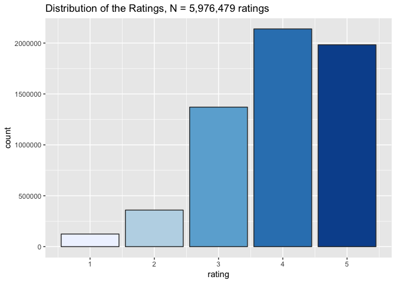<!-- -->

Here is the five-number summary of the 6 million ratings by 10 thousand
users.

``` r
  summary(ratings$rating)
```

    ##    Min. 1st Qu.  Median    Mean 3rd Qu.    Max. 
    ##    1.00    3.00    4.00    3.92    5.00    5.00

The minimum rating was 1 star, the maximum was 5 stars, the mean was
3.92 stars while the median was 4 stars.

## RATINGS BY USERS

``` r
p <- ratings %>% 
  group_by(user_id) %>% 
  summarize(number_of_ratings_per_user = n())

p %>% 
  ggplot(aes(number_of_ratings_per_user)) + 
  geom_bar(fill = "orange", color = "grey20", binwidth = 10) +
   ggtitle("Distribution of the Number of Ratings Per User, N = 5,976,479 ratings")
```

    ## Warning: `geom_bar()` no longer has a `binwidth` parameter. Please use
    ## `geom_histogram()` instead.

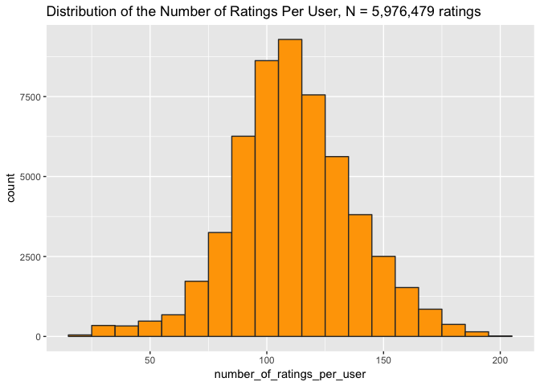<!-- -->

``` r
summary(p)
```

    ##     user_id      number_of_ratings_per_user
    ##  Min.   :    1   Min.   : 19.0             
    ##  1st Qu.:13357   1st Qu.: 96.0             
    ##  Median :26712   Median :111.0             
    ##  Mean   :26712   Mean   :111.9             
    ##  3rd Qu.:40068   3rd Qu.:128.0             
    ##  Max.   :53424   Max.   :200.0

From the graph above, we noticed that individual user rated from 19 to
200 times. The mean and the median was 111 ratings per user. The
distribution was almost normally distributed.

## RATER’S BIAS - Mean User Ratings

``` r
ratings %>% 
  group_by(user_id) %>% 
  summarize(mean_user_rating = mean(rating)) %>% 
  ggplot(aes(mean_user_rating)) +
  geom_histogram(fill = "cadetblue3", color = "grey20", binwidth = .1)
```

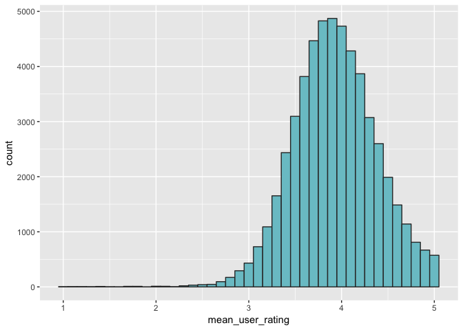<!-- -->

The graph above shows the distribution of the mean user ratings. We took
the average ratings given by each ussers to all the books he or she
rated, then plot the distribution of the mean ratings. We noticed that
the central tendency of the rating is around 4 stars. Few users rated
all their books perfectly. No rater was a down-rater or those who
consistently rated the books low. This graph tells us about biases of
the individual users and will be important when we compute the user bias
in the crowd filtering algorithm later.

## BOOKS POPULARITY - Number of Ratings Per Book

One way to measure the popularity of a book is by counting the number of
ratings it received. Books that are purchased the most can get the most
number of ratings as well.

``` r
q<- ratings %>% 
  group_by(book_id) %>% 
  summarize(number_of_ratings_per_book = n())
q %>% 
  ggplot(aes(number_of_ratings_per_book)) + 
  geom_bar(fill = "orange", color = "grey20")  +
  scale_x_log10()
```

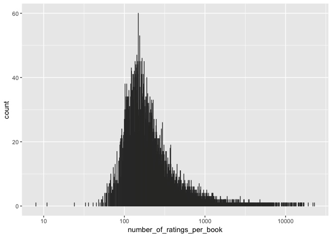<!-- -->

``` r
summary(q)
```

    ##     book_id      number_of_ratings_per_book
    ##  Min.   :    1   Min.   :    8.0           
    ##  1st Qu.: 2501   1st Qu.:  155.0           
    ##  Median : 5000   Median :  248.0           
    ##  Mean   : 5000   Mean   :  597.6           
    ##  3rd Qu.: 7500   3rd Qu.:  503.0           
    ##  Max.   :10000   Max.   :22806.0

The graph above shows that some books received more than ten thousand
ratings, while others have less than 50 ratings. On average, a book
received 597 ratings. The median was 248 times, the minimum was 8 times
while the maximum was 22,806 times.

## BOOKS BIAS - Mean Book Ratings

``` r
b <- ratings %>% 
  group_by(book_id) %>% 
  summarize(mean_book_rating = mean(rating)) 
b %>% 
  ggplot(aes(mean_book_rating)) + geom_histogram(fill = "orange", color = "grey20", binwidth = .1) + coord_cartesian(c(1,5))
```

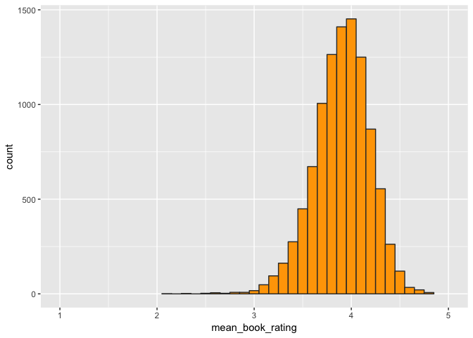<!-- -->

``` r
summary(b)
```

    ##     book_id      mean_book_rating
    ##  Min.   :    1   Min.   :2.078   
    ##  1st Qu.: 2501   1st Qu.:3.728   
    ##  Median : 5000   Median :3.922   
    ##  Mean   : 5000   Mean   :3.903   
    ##  3rd Qu.: 7500   3rd Qu.:4.098   
    ##  Max.   :10000   Max.   :4.830

The graph above shows the distribution of the books by their mean
ratings. The lowest-rated book got an average of 2.078 stars while the
highest-rated book got 4.83 stars. The mean and the median were both 3.9
stars.

## EXPLORING BOOKS BY GENRES

Let us explore the genres of the books in our data
set

``` r
genres <- str_to_lower(c("Art", "Biography", "Business", "Chick Lit", "Children's", "Christian", "Classics", "Comics", "Contemporary", "Cookbooks", "Crime", "Ebooks", "Fantasy", "Fiction", "Gay and Lesbian", "Graphic Novels", "Historical Fiction", "History", "Horror", "Humor and Comedy", "Manga", "Memoir", "Music", "Mystery", "Nonfiction", "Paranormal", "Philosophy", "Poetry", "Psychology", "Religion", "Romance", "Science", "Science Fiction", "Self Help", "Suspense", "Spirituality", "Sports", "Thriller", "Travel", "Young Adult"))

exclude_genres <- c("fiction", "nonfiction", "ebooks", "contemporary")
genres <- setdiff(genres, exclude_genres)

available_genres <- genres[str_to_lower(genres) %in% tags$tag_name]
available_tags <- tags$tag_id[match(available_genres, tags$tag_name)]

tmp <- book_tags %>% 
  filter(tag_id %in% available_tags) %>% 
  group_by(tag_id) %>%
  summarize(n = n()) %>%
  ungroup() %>%
  mutate(sumN = sum(n), percentage = n / sumN) %>%
  arrange(-percentage) %>%
  left_join(tags, by = "tag_id")

tmp %>% 
  ggplot(aes(reorder(tag_name, percentage), percentage, fill = percentage)) + geom_bar(stat = "identity") + coord_flip() + scale_fill_distiller(palette = 'YlOrRd') + labs(y = 'Percentage', x = 'Genre')
```

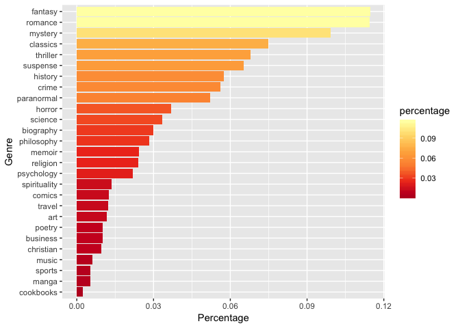<!-- -->
The top 5 most common book genres in our data set are fantasy, romance,
mystery, classics, and thriller. The least common genres are cookbook,
manga, sports, music and Christians.

## MOST POPULAR BOOKS - HIGHEST STAR RATINGS

Let us look at the most popular books based on the star ratings they
received.

``` r
books %>% 
  mutate(image = paste0('</img>')) %>% 
  arrange(-average_rating) %>% 
  top_n(10,wt = average_rating) %>% 
  select(image, title, ratings_count, average_rating) %>% 
  datatable(class = "nowrap hover row-border", escape = FALSE, options = list(dom = 't',scrollX = TRUE, autoWidth = TRUE))
```

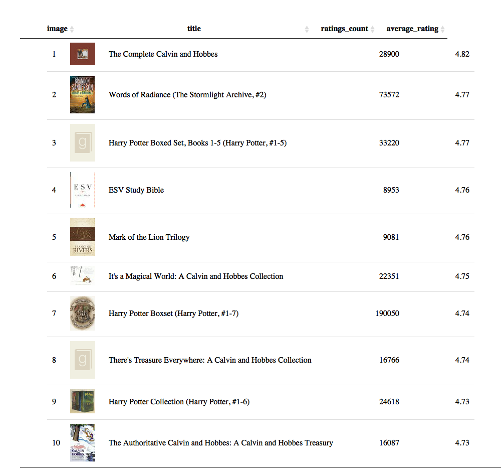<!-- -->

# MOST POPULAR BOOK - MOST NUMBER OF RATINGS

Another way to define a book’s popularity is by the number of ratings it
received.

``` r
books %>% 
  mutate(image = paste0('</img>')) %>% 
  arrange(-ratings_count) %>% 
  top_n(10,wt = ratings_count) %>% 
  select(image, title, ratings_count, average_rating) %>% 
  datatable(class = "nowrap hover row-border", escape = FALSE, options = list(dom = 't',scrollX = TRUE, autoWidth = TRUE))
```

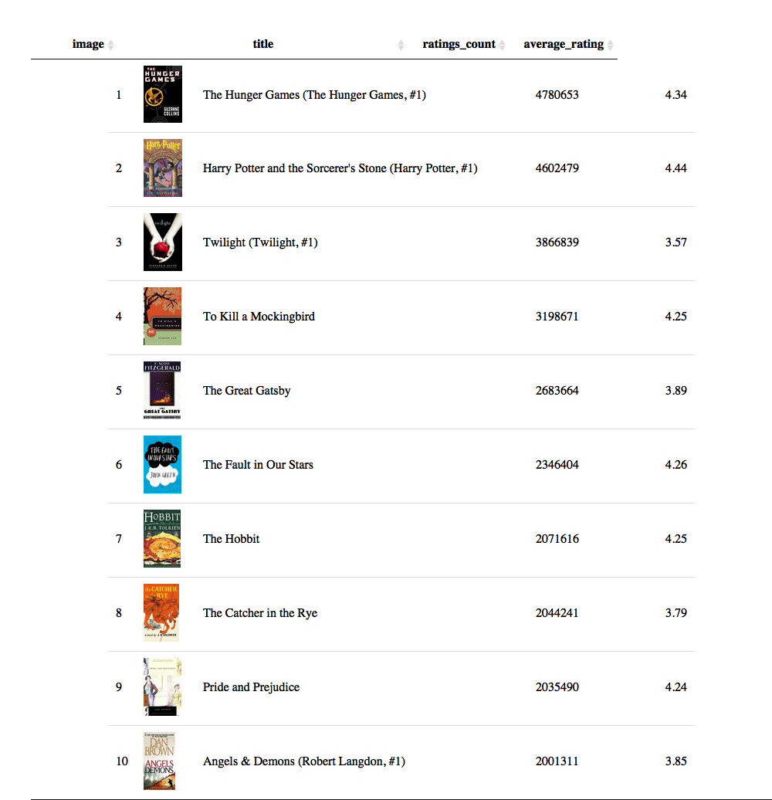<!-- -->

## META-DATA THAT CORRELATES WITH RATINGS

Do `book counts`, `original publication year`, `rating counts`, and
`work text review count` affect a book’s ratings? We used the
pairs.panels() function from Psyche package to summarize in a single
graph the correlations between book ratings and meta-data predictors, as
well as the shapes of their distributions.

``` r
tmp <- books %>% 
  select(one_of(c("books_count","original_publication_year","ratings_count", "work_ratings_count", "work_text_reviews_count", "average_rating"))) %>% 
  as.matrix()

#corrplot(cor(tmp, use = 'pairwise.complete.obs'), type = "lower")

pairs.panels(tmp, alpha=.05)
```

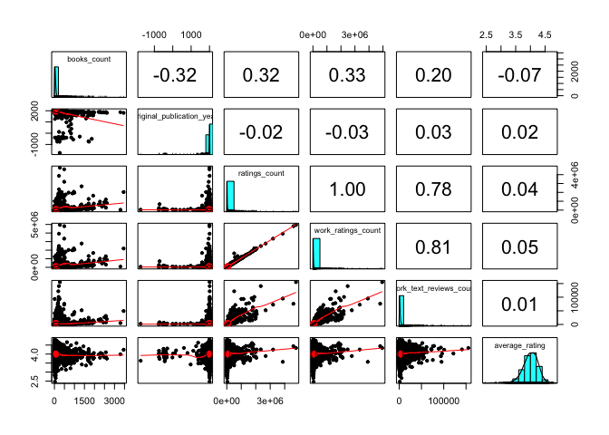<!-- -->

The graph above revealed that their was an almost zero negligible
correlations between the books’ average ratings and work text review
counts (r = 0.01), work rating count ( r = 0.05), rating counts (r =
0.04), original publication (r = 0.02) and book counts (r = -0.07).
These results show that meta-variables have no strong correlation to the
book ratings. For example, the notion that books with a lot of ratings
will get high reviews was not supported by the data (rating counts r =
0.04). Also, book counts did not correlate with ratings as well (book
counts r = -0.07).

# BOOK TITLE EFFECT

Does the length of the book’s title affect its ratings? Let us
investigate by grouping the books by title length and compute their
summary statistics.

``` r
books <- books %>% 
  mutate(title_cleaned = str_trim(str_extract(title, '([0-9a-zA-Z]| |\'|,|\\.|\\*)*')),
         title_length = str_count(title_cleaned, " ") + 1) 

tmp <- books %>% 
  group_by(title_length) %>% 
  summarize(n = n()) %>% 
  mutate(ind = rank(title_length))

books %>% 
  ggplot(aes(factor(title_length), average_rating, color=factor(title_length), group=title_length)) +
  geom_boxplot() + guides(color = FALSE) + labs(x = "Title length") + coord_cartesian(ylim = c(2.2,4.7)) + geom_text(aes(x = ind,y = 2.25,label = n), data = tmp)
```

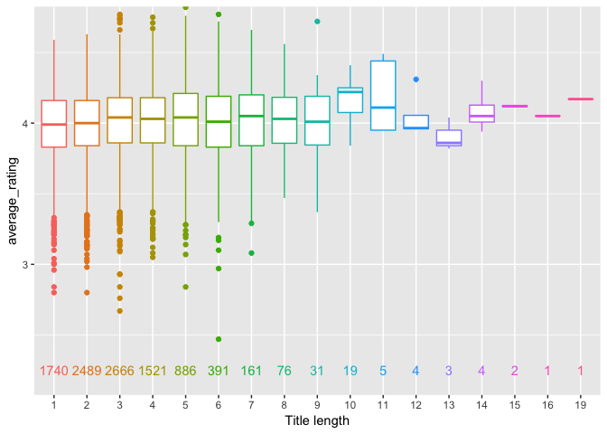<!-- -->

The average ratings of the books does not vary significantly based on
the book title length. Most of the books in the database have titles
from 1 to 10 words.

## CAN SUBTITLES MAKE A BOOK POPULAR?

We saw that books subtitles was rated slightly higher than books without
subtitles.

``` r
books <- books %>% 
  mutate(subtitle = str_detect(books$title, ':') * 1, subtitle = factor(subtitle))

books %>% 
  ggplot(aes(subtitle, average_rating, group = subtitle, color = subtitle)) + 
  geom_boxplot() + guides(color = FALSE)
```

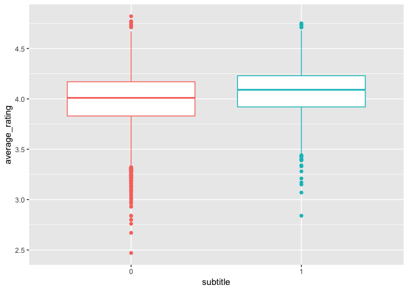<!-- -->

The plot shows that the average rating of the books improve slightly
when a subtitle is preset.

# BUILDING A MODEL

Now that we know some basic facts about our data set,let’s randomly
split the `ratings` data set into training and testing data set. We will
use the Caret package to create a training and a testing sets. The train
set will contain 90% of the data while the test set will contain the
remaining 10%. The train set will be called *train\_set* while the test
set will be called *test\_set*.

``` r
set.seed(1)
test_index <- createDataPartition(y = ratings$rating, times = 1, p = 0.1, list = FALSE)
train_set <- ratings[-test_index,]
temp <- ratings[test_index,]

# Make sure user_id and book_id in test_set set are also in train_set

test_set <- temp %>% 
     semi_join(train_set, by = "book_id") %>%
     semi_join(train_set, by = "user_id")

# Add rows removed from test_set set back into train_set

removed <- anti_join(temp, test_set)
```

    ## Joining, by = c("user_id", "book_id", "rating")

``` r
train_set <- rbind(train_set, removed)
```

# ROOT MEAN SQUARED ERROR CALCULATION

Let us define the root mean squared error (RMSE) function that we will
use to evaluate our model later.

``` r
#Root Mean Square Error Loss Function
RMSE <- function(true_ratings, predicted_ratings){
  sqrt(mean((true_ratings - predicted_ratings)^2))
}
```

Our goal is to fit a model that is learnt in the `train_set` that we can
use to predict user ratings for the books in the `test_set`.

## NAIVE RMSE

To begin, let’s fit the simplest possible model: first, let us not do
any statistical work at all and simply predict every single rating to be
the average rating in the training
set.

``` r
## testing the RMSE function using just the average rating in the train_set data set
average_rating <- mean(ratings$rating)
predictions <- rep(average_rating, nrow(test_set))
naive_rmse <- RMSE(test_set$rating, predictions)
print(naive_rmse)
```

    ## [1] 0.9892301

We got a naive RMSE of 0.9892301. This means that by using the average
rating in the `train_set` to predict the ratings in the `test_set`, we
are committing on average about 1-star rating above or below the true
rating. This is a high error rate. We want to lower this error by about
10-15 percent.

# COLLABORATIVE FILTERING

In our data set, we have information about individual users and
individual books. We say that individual users have their own
preferences, biases and rating standards. Similarly we can assume that
some books are probably much better than other books.

Let us use this intuition to build our model.

## DIFFERENCES AMONG BOOKS

Let’s build a simple model that accounts for differences among books.

To account for the different ratings, we would model the observed rating
\(Y_{u,i}\) for user \(u\) and book \(i\) like this:

\[
Y_{u,i} = \mu + \varepsilon_{u,i}
\]

where \(\mu\) is the average rating and \(\varepsilon_{u,i}\) a random
term explaining the differences between ratings.

But we know that some books are better than others. So we can add a term
\(b_i\) to account for this and augment the model to

\[
Y_{u,i} = \mu + b_i + \varepsilon_{u,i}
\]

We call the \(b\)s as effects or bias.

To make a prediction we need to estimate \(b_i\). We could use the
`lm()` function to obtain least square estimates but due to our large
data set, using `lm()` will take a long time to process.

Because we know that the least square estimate is just the average of
\(Y_{u,i} - \hat{\mu}\) for each book, where \(\hat{\mu}\) the average
rating in `train_set`, we can simply use these averages.

So, our task now are:

1)  Compute an estimate \(\hat{b}_i\) for each \(b_i\).
2)  Visualize and describe the distribution of the \(\hat{b}_i\).
3)  Create a prediction with \(\hat{\mu} + \hat{b}_i\) and calculate the
    RMSE.

# RESULTS

Here is our code to compute the Book Effect or Bias.

``` r
# compute an estimate for each b_i
# this will calculate the mean of ratings from the train_set
  mu <- mean(ratings$rating)

# compute an estimate for book effect b_i
  b_i <- train_set %>% 
    group_by(book_id) %>%
    summarize(b_i = sum(rating - mu)/(n()))
  
  ### Explore the distribution
  hist(b_i$b_i, main="Book Effects", xlab= "Book Effects", col="orange")
```

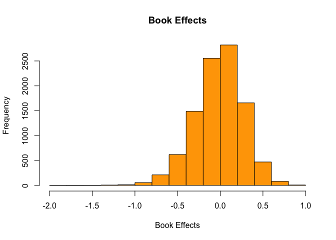<!-- -->

``` r
  summary(b_i$b_i)
```

    ##      Min.   1st Qu.    Median      Mean   3rd Qu.      Max. 
    ## -1.897052 -0.191464  0.002357 -0.016774  0.178769  0.913086

Here is the code to compute for the user effect bias.

``` r
  # compute an estimate for user effect b_u
  b_u <- train_set %>% 
    left_join(b_i, by="book_id") %>%
    group_by(user_id) %>%
    summarize(b_u = sum(rating - b_i - mu)/(n()))
  
  ### Explore the distribution
  hist(b_u$b_u, main = "User Effect / Bias", xlab = "User Effect / Bias", col="orange")
```

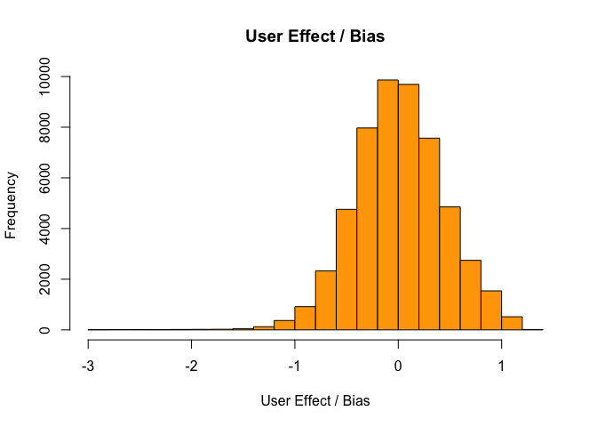<!-- -->

``` r
  summary(b_u$b_u)
```

    ##      Min.   1st Qu.    Median      Mean   3rd Qu.      Max. 
    ## -2.981200 -0.273182  0.004498  0.008969  0.295206  1.362807

Notice from the above two graphs and summaries that the average book
bias was negative (-0.016774), while the average user bias was positive
(0.008969). Both of these two biases will be factored in our model.

Let us now join together the book and user biases in our train\_set and
create another column containing the pairwise prediction using the
model, predicted\_ratings equals the mean of all ratings plus book bias
plus user bias (pred = mu + b\_i + b\_u). We can use the results to
compute our new RMSE using the code
below.

``` r
#predict ratings in the train_set to derive optimal penalty value 'lambda'
predicted_ratings <- 
    train_set %>% 
    left_join(b_i, by = "book_id") %>%
    left_join(b_u, by = "user_id") %>%
    mutate(pred = mu + b_i + b_u) %>%
    .$pred
  
  RMSE(predicted_ratings, train_set$rating)
```

    ## [1] 0.847112

Our Residual Mean Squared Error of 0.0.847112 is now significantly lower
that the naive RMSE we computed before. But we are not done yet.

In the train\_set exploration we noted that the supposedly “best” and
“worst” books were rated by relatively fewer raters. With few raters,
uncertainty is higher. Consequently, larger estimates of \(b_i\),
negative or positive, are more likely. These are “noisy” estimates that
we should not trust in our predictions. Because large prediction errors
can increase our RMSE, we would rather be conservative. We can
accomplish that by introduction certain small values lambda and adding
it in the denominator when we get the average bias. Increasing the
denominator will result to a higher RMSE, and hence, make our
predictions more conservative.

# REGULARIZATION

Regularization adds a penalty on the different parameters of the model
to reduce the freedom of the model. Hence, the model will be less likely
to fit the noise of the training data and will improve the
generalization abilities of the model.

Regularization permits us to penalize large estimates that come from
small sample sizes. The general idea is to minimize a penalized least
squares
equation

\[\sum_{i=1}^I \sum_{u=1}^{n_i} (Y_{u,i} - \mu - b_i)^2 + \lambda \sum_{i=1}^I b_i^2\]

This leads to a regularized estimate that can be approximated with: \[
\hat{b}_i(\lambda) = \frac{1}{\lambda + n_i} \sum_{u=1}^{n_i} (Y_{u,i} - \hat{\mu})
\]

where \(n_i\) is the number of ratings made for books \(i\). The larger
the \(\lambda\) or the smaller the \(n_i\), the more we “shrink”
\(\hat{b}_i(\lambda)\) to 0.

# PARAMETER TUNING

## Choosing a lambda to minimize RMSE

We will choose a small increment we will call as lambda as our tuning
parameter.

``` r
lambdas <- seq(0, 2, 0.25)
rmses <- sapply(lambdas,function(lamb){
  
  #it will Calculate the mean of ratings from the train_set
  mu <- mean(train_set$rating)
  
  #there is the need to adjust mean by book effect and penalize low number on ratings
  b_i <- train_set %>% 
    group_by(book_id) %>%
    summarize(b_i = sum(rating - mu)/(n()+lamb))
  
  #ajdust mean by user and book effects and penalize low number of ratings
  b_u <- train_set %>% 
    left_join(b_i, by="book_id") %>%
    group_by(user_id) %>%
    summarize(b_u = sum(rating - b_i - mu)/(n()+lamb))
  
  #predict ratings in the train_set to derive optimal penalty value 'lambda'
  predicted_ratings <- 
    train_set %>% 
    left_join(b_i, by = "book_id") %>%
    left_join(b_u, by = "user_id") %>%
    mutate(pred = mu + b_i + b_u) %>%
    .$pred
  
  return(RMSE(predicted_ratings, train_set$rating))
})
```

Here is the plot of our RMSEs by lambdas

``` r
plot(lambdas, rmses,
     col = "red", main = "Tuning Parameter, Lambdas")
```

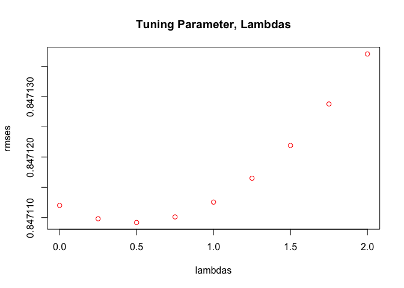<!-- -->

# FINAL RESULTS FOR OPTIMAL RMSE AFTER TUNING

We can now compute the optimal RMSE using this code.

``` r
lambda <- lambdas[which.min(rmses)]
paste('Optimal RMSE of',min(rmses),'is achieved with Lambda',lambda)
```

    ## [1] "Optimal RMSE of 0.847109192535059 is achieved with Lambda 0.5"

# *The lowest RMSE of, 0.847109192535059, was achieved at lambda equals 0.5.*

# PREDICTION

Our prediction was computed using the model that yield the the minimum
RMSE of 0.847112 at Lambda equals 0.5. Here is the code.

``` r
#Apply Lamda on test_set for Data-Export
lambda <- 0.5
      
pred_y_lse <- sapply(lambda,function(lamb){
  
  # Derive the mear from the training set
  mu <- mean(train_set$rating)
  
  # Calculate book effect with optimal lambda
b_i <- train_set %>% 
    group_by(book_id) %>%
    summarize(b_i = sum(rating - mu)/(n()+lamb))
  
  #Calculate user effect with optimal lambda
b_u <- train_set %>% 
    left_join(b_i, by="book_id") %>%
    group_by(user_id) %>%
    summarize(b_u = sum(rating - b_i - mu)/(n()+lamb))
  
  #Predict ratings on test_set
predicted_ratings <- 
    test_set %>% 
    left_join(b_i, by = "book_id") %>%
    left_join(b_u, by = "user_id") %>%
    mutate(pred = mu + b_i + b_u) %>%
    .$pred # test_set

  RMSE(predicted_ratings, test_set$rating)

})
```

Finally, to test our model, we computed the RMSE on `test_set`. Here is
the RMSE for the test\_set.

``` r
pred_y_lse
```

    ## [1] 0.8563726

``` r
paste('For the test_set the optimal RMSE is',pred_y_lse,'.')
```

    ## [1] "For the test_set the optimal RMSE is 0.856372561104327 ."

The value was close to what we got in the `train_set`. We are now more
confident that our model works.

# FINAL COMPUTED RMSE

Here is the comparison of the RMSEs of train\_set and test\_set).

``` r
 # train_set
   paste('For train_set the optimal RMSE of',min(rmses),'is achieved with Lambda',lambda)
```

    ## [1] "For train_set the optimal RMSE of 0.847109192535059 is achieved with Lambda 0.5"

``` r
 # test_set
   paste('For the test_set the optimal RMSE is',pred_y_lse,'.')
```

    ## [1] "For the test_set the optimal RMSE is 0.856372561104327 ."

    ### Naive RMSE                               | 0.9892301
    ### Mean + books + users in Train Set        | 0.847112
    ### Mean + books + users in Test Set         | 0.8563726

*The mean + book + users minimized the RMSE by about 15 percent when
compared to naive RMSE*. Using other factors like year of publication,
authors, and other mata-data pairwise with ratings did not result to
significant error minimization.

# CONCLUSION

This project aimed at predicting the book ratings using the machine
learning process of first training and learning from the subset of our
data called training set. We train a model that minimizes the residual
mean squared error between our model’s predicted rating and the actual
ratings. In this study, we achieved that by using a model that accounts
for the books’ and users’ biases. We used a collaborative filtering
algorithm that uses User-based Nearest Neighbor filtering (“accounted by
users’ bias”) and Item-based Nearest Neighbor filtering (accounted by
the books’ bias). We observed some tendencies of the users such as their
tendency to rate the books higher. We also noted the skewed rating of
books that tend to center around 3 and 4 stars. We saw that the matrix
was too sparse because there were too many books to rate and majority of
the users were not active raters. We accounted for all these explicit
and implicit biases in the crowd sourcing part of our model.
Furthermore, on the books side, we also noticed that some books were
published long time ago and were in the market for longer period of time
that the other books. These books tend to get more rating due to the
length of time exposure. Some books were authored by several authors;
some have short and some have long titles. Some books have sub-titles;
some books were popular and many were not. We accounted for all these
observed variations in the books’ bias of our final model. Finally,
newer books that got less reviewer either to be rated too high or too
low because of lesser sample size. These caused more uncertainty in our
prediction. This problem was addressed by using a tuning parameter we
call lambda to make our prediction more conservative (when computing for
the mean error, increasing the value of n by certain arbitrary small
constant we call lambda makes our denominator higher resulting to a a
smaller mean and consequently a little higher RMSE, hence a more
conservative RMSE).

Collaborative Filtering has its own limitations also, like cold start.
When a book is new, it is hard for our model to recommend it because
there is less information to base our filtering algorithm on. This is
usually addressed by asking new users a few questions the first time
they sign up.
